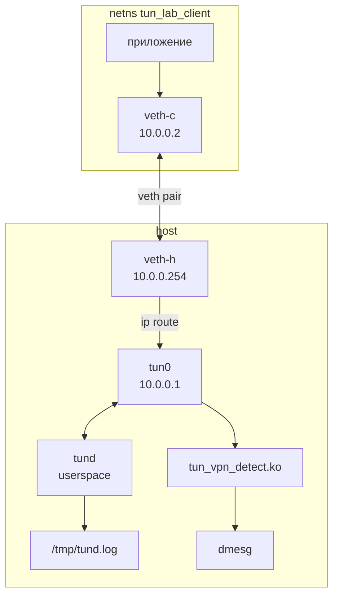

# Архитектура: единый комплекс TUN Traffic Filter

## Назначение

Один программный комплекс на базе **TUN-драйвера Linux**: виртуальный интерфейс `tun0` — единственная точка перехвата IP-трафика в lab-стенде. Анализ и фильтрация выполняются в userspace; обнаружение VPN и вывод в консоль ядра — в companion-модуле **только для трафика, связанного с `tun0`**.

## Топология lab-стенда

Создаётся скриптом `scripts/setup_lab.sh` после поднятия `tun0` демоном `tund`.

```text
  ┌──────────────────────────────────────────────────────────────┐
  │  netns: tun_lab_client                                       │
  │                                                              │
  │   приложение (ping, nc, VPN-like)                            │
  │        │                                                     │
  │        ▼                                                     │
  │   10.0.0.2 ─────── veth-c ═══════════ veth-h ───────┐        │
  └──────────────────────────────────────────────────────┼────────┘
                                                         │
  ┌──────────────────────────────────────────────────────┼────────┐
  │  host (основной network namespace)                   │        │
  │                                                      ▼        │
  │                              veth-h  10.0.0.254               │
  │                                   │                           │
  │                                   │  маршрутизация            │
  │                                   ▼                           │
  │                              tun0  10.0.0.1                   │
  │                                   │                           │
  │                    ┌──────────────┴──────────────┐            │
  │                    │                             │            │
  │                    ▼                             ▼            │
  │              tund (userspace)          tun_vpn_detect.ko      │
  │              /dev/net/tun              Netfilter hook         │
  │                    │                             │            │
  │                    ▼                             ▼            │
  │            /tmp/tund.log                   dmesg (printk)       │
  │            ACCEPT / BLOCK                NEW VPN              │
  └───────────────────────────────────────────────────────────────┘
```

**Маршруты (ключевые):**

| Узел | Маршрут | Смысл |
|------|---------|-------|
| client `10.0.0.2` | `10.0.0.1/32 via 10.0.0.254` | Трафик к TUN идёт через veth на хост |
| host | `10.0.0.2/32 dev tun0` | Ответы к клиенту — через `tun0` |

**IP-адреса:**

| Интерфейс | IP | Где |
|-----------|-----|-----|
| `veth-c` | `10.0.0.2/24` | netns `tun_lab_client` |
| `veth-h` | `10.0.0.254/24` | host |
| `tun0` | `10.0.0.1/24` | host (создаёт `tund`) |



## Поток данных

```mermaid
flowchart LR
  subgraph client_ns [netns client]
    C[10.0.0.2]
  end
  subgraph host [host namespace]
    V[veth-h]
    T[tun0 + tund]
    K[tun_vpn_detect.ko]
    C --> V
    V --> T
    T --> K
    K --> dmesg[dmesg]
    T --> log[/tmp/tund.log]
  end
```

1. Клиент (`10.0.0.2`) отправляет пакет на адрес в сети lab (`10.0.0.1` или через маршрут).
2. Пакет приходит на хост по `veth-h`, маршрутизируется на `tun0`.
3. **`tund`** читает пакет из `/dev/net/tun`, парсит L3/L4, применяет `config/rules.conf`, пишет ACCEPT/BLOCK в очередь логов.
4. Разрешённый пакет записывается обратно в TUN (или отбрасывается).
5. **`tun_vpn_detect.ko`** на hook Netfilter видит пакеты с `in/out == tun0` (и inbound с lab veth на IP `tun0`), детектирует VPN, ставит событие в очередь → **workqueue** → `printk` (не в hook).

## Разделение ответственности

| Компонент | Файлы | Делает | Не делает |
|-----------|-------|--------|-----------|
| TUN driver (ядро) | `/dev/net/tun` | Виртуальный интерфейс | VPN, правила |
| **tund** | `src/*.c` | Парсинг, фильтрация, лог ACCEPT/BLOCK | `printk`, VPN |
| **tun_vpn_detect.ko** | `kernel/*.c` | VPN-сигнатуры, NEW flow → dmesg | Фильтрация по rules.conf |

## Выходы логирования

| Событие | Куда | Hot path |
|---------|------|----------|
| ACCEPT / BLOCK | `/tmp/tund.log`, stderr | Очередь + поток (`log_queue.c`) |
| NEW VPN | `dmesg` | Очередь + workqueue (`log_work_handler`) |

## Параметры kernel-модуля

| Параметр | По умолчанию | Описание |
|----------|--------------|----------|
| `iface` | `tun0` | Имя TUN-интерфейса для фильтра hook |
| `lab_if` | `veth-h` | Lab veth на хосте (inbound к IP tun0) |
| `tun_ip` | `10.0.0.1` | IPv4 адрес TUN для inbound-детекта |

## Запуск

```bash
sudo ./scripts/start.sh    # lab + insmod + tund
sudo ./scripts/stop.sh     # остановка
sudo ./scripts/test_all.sh # автопроверка
```

Подробнее: [TEST_PLAN.md](TEST_PLAN.md).
